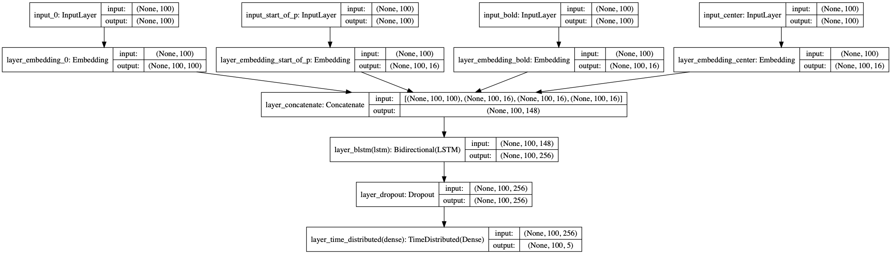

# Handle Numeric features

**This feature is a experimental feature**

https://github.com/BrikerMan/Kashgari/issues/90

Some time, except the text, we have some additional features like text formatting (italic, bold, centered), 
position in text and more. Kashgari provides `NumericFeaturesEmbedding` and `StackedEmbedding` for this kine data. Here is the details.

If you have a dataset like this.

```python
token=NLP       start_of_p=True    bold=True     center=True     B-Category
token=Projects  start_of_p=False   bold=True     center=True     I-Category
token=Project   start_of_p=True    bold=True     center=False    B-Project-name
token=Name      start_of_p=False   bold=True     center=False    I-Project-name
token=:         start_of_p=False   bold=False    center=False    I-Project-name
```

First, numerize your additional features. Convert your data to this. Remember to leave `0` for padding.

```python
text = ['NLP', 'Projects', 'Project', 'Name', ':']
start_of_p = [1, 2, 1, 2, 2]
bold = [1, 1, 1, 1, 2]
center = [1, 1, 2, 2, 2]
label = ['B-Category', 'I-Category', 'B-Project-name', 'I-Project-name', 'I-Project-name']
```

Then you have four input sequence and one output sequence. Prepare your embedding layers.

```python
import kashgari
from kashgari.embeddings import NumericFeaturesEmbedding, BareEmbedding, StackedEmbedding

import logging
logging.basicConfig(level='DEBUG')

text = ['NLP', 'Projects', 'Project', 'Name', ':']
start_of_p = [1, 2, 1, 2, 2]
bold = [1, 1, 1, 1, 2]
center = [1, 1, 2, 2, 2]
label = ['B-Category', 'I-Category', 'B-ProjectName', 'I-ProjectName', 'I-ProjectName']

text_list = [text] * 100
start_of_p_list = [start_of_p] * 100
bold_list = [bold] * 100
center_list = [center] * 100
label_list = [label] * 100


SEQUENCE_LEN = 100

# You can use WordEmbedding or BERTEmbedding for your text embedding
text_embedding = BareEmbedding(task=kashgari.LABELING, sequence_length=SEQUENCE_LEN)
start_of_p_embedding = NumericFeaturesEmbedding(feature_count=2,
                                                feature_name='start_of_p',
                                                sequence_length=SEQUENCE_LEN)

bold_embedding = NumericFeaturesEmbedding(feature_count=2,
                                                feature_name='bold',
                                                sequence_length=SEQUENCE_LEN)

center_embedding = NumericFeaturesEmbedding(feature_count=2,
                                                feature_name='center',
                                                sequence_length=SEQUENCE_LEN)

# first one must be the text embedding
stack_embedding = StackedEmbedding([
    text_embedding,
    start_of_p_embedding,
    bold_embedding,
    center_embedding
])

x = (text_list, start_of_p_list, bold_list, center_list)
y = label_list
stack_embedding.analyze_corpus(x, y)

# Now we can embed with this stacked embedding layer
print(stack_embedding.embed(x))
```

Once embedding layer prepared, you could use all of the classification and labeling models.

```python
# We can build any labeling model with this embedding

from kashgari.tasks.labeling import BLSTMModel
model = BLSTMModel(embedding=stack_embedding)
model.fit(x, y)

print(model.predict(x))
print(model.predict_entities(x))
```

This is the struct of this model.

