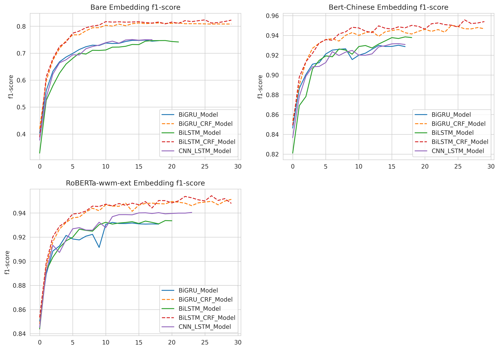

# Text Labeling Model

Kashgari provides several models for text labeling,
All labeling models inherit from the `BaseLabelingModel`.
You could easily switch from one model to another just by changing one line of code.

## Available Models

| Name               | Info |
| ------------------ | ---- |
| CNN\_LSTM\_Model   |      |
| BiLSTM\_Model      |      |
| BiGRU\_Model       |      |

## Train basic NER model

Kashgari provices basic NER corpus for expirement. You could also use your corpus in any language for training.

```python
# Load build-in corpus.
from kashgari.corpus import ChineseDailyNerCorpus

train_x, train_y = ChineseDailyNerCorpus.load_data('train')
valid_x, valid_y = ChineseDailyNerCorpus.load_data('valid')
test_x, test_y = ChineseDailyNerCorpus.load_data('test')

# Or use your own corpus
train_x = [['Hello', 'world'], ['Hello', 'Kashgari'], ['I', 'love', 'Beijing']]
train_y = [['O', 'O'], ['O', 'B-PER'], ['O', 'B-LOC']]

valid_x, valid_y = train_x, train_y
test_x, test_x = train_x, train_y
```

Or use your own corpus, it needs to be tokenized like this.

```python
>>> print(train_x[0])
['海', '钓', '比', '赛', '地', '点', '在', '厦', '门', '与', '金', '门', '之', '间', '的', '海', '域', '。']

>>> print(train_y[0])
['O', 'O', 'O', 'O', 'O', 'O', 'O', 'B-LOC', 'I-LOC', 'O', 'B-LOC', 'I-LOC', 'O', 'O', 'O', 'O', 'O', 'O']
```

Then train our first model. All models provided some APIs, so you could use any labeling model here.

```python
import kashgari
from kashgari.tasks.labeling import BiLSTM_Model

model = BiLSTM_Model()
model.fit(train_x, train_y, valid_x, valid_y)

# Evaluate the model

model.evaluate(test_x, test_y)

# Model data will save to `saved_ner_model` folder
model.save('saved_ner_model')

# Load saved model
loaded_model = BiLSTM_Model.load_model('saved_ner_model')
loaded_model.predict(test_x[:10])

# To continue training, compile the newly loaded model first
loaded_model.compile_model()
model.fit(train_x, train_y, valid_x, valid_y)
```

That's all your need to do. Easy right.

## Sequence labeling with transfer learning

Kashgari provides varies Language model Embeddings for transfer learning. Here is the example for BERT Embedding.

```python
from kashgari.tasks.labeling import BiLSTM_Model
from kashgari.embeddings import BertEmbedding

bert_embed = BertEmbedding('<PRE_TRAINED_BERT_MODEL_FOLDER>')
model = BiLSTM_Model(bert_embed, sequence_length=100)
model.fit(train_x, train_y, valid_x, valid_y)
```

You could replace bert_embedding with any Embedding class in `kashgari.embeddings`. More info about Embedding: LINK THIS.

## Adjust model's hyper-parameters

You could easily change model's hyper-parameters. For example, we change the lstm unit in `BLSTMModel` from 128 to 32.

```python
from kashgari.tasks.labeling import BiLSTM_Model

hyper = BiLSTM_Model.default_hyper_parameters()
print(hyper)
# {'layer_blstm': {'units': 128, 'return_sequences': True}, 'layer_dropout': {'rate': 0.4}, 'layer_time_distributed': {}, 'layer_activation': {'activation': 'softmax'}}

hyper['layer_blstm']['units'] = 32

model = BiLSTM_Model(hyper_parameters=hyper)
```

## Use custom optimizer

Kashgari already supports using customized optimizer, like RAdam.

```python
from kashgari.corpus import SMP2018ECDTCorpus
from kashgari.tasks.classification import BiLSTM_Model
# Remember to import kashgari before than RAdam
from keras_radam import RAdam

train_x, train_y = SMP2018ECDTCorpus.load_data('train')
valid_x, valid_y = SMP2018ECDTCorpus.load_data('valid')
test_x, test_y = SMP2018ECDTCorpus.load_data('test')

model = BiLSTM_Model()
# This step will build token dict, label dict and model structure
model.build_model(train_x, train_y, valid_x, valid_y)
# Compile model with custom optimizer, you can also customize loss and metrics.
optimizer = RAdam()
model.compile_model(optimizer=optimizer)

# Train model
model.fit(train_x, train_y, valid_x, valid_y)
```

## Use callbacks

Kashgari is based on keras so that you could use all of the [tf.keras callbacks](https://www.tensorflow.org/api_docs/python/tf/keras/callbacks) directly with
Kashgari model. For example, here is how to visualize training with tensorboard.

```python
from tensorflow import keras
from kashgari.tasks.labeling import BiLSTM_Model
from kashgari.callbacks import EvalCallBack


model = BLSTMModel()

tf_board_callback = keras.callbacks.TensorBoard(log_dir='./logs', update_freq=1000)

# Build-in callback for print precision, recall and f1 at every epoch step
eval_callback = EvalCallBack(kash_model=model,
                             valid_x=valid_x,
                             valid_y=valid_y,
                             step=5)

model.fit(train_x,
          train_y,
          valid_x,
          valid_y,
          batch_size=100,
          callbacks=[eval_callback, tf_board_callback])
```

## Customize your own model

It is very easy and straightforward to build your own customized model,
just inherit the `ABCLabelingModel` and implement the `default_hyper_parameters()` function
and `build_model_arc()` function.

```python
from typing import Dict, Any

from tensorflow import keras

from kashgari.tasks.labeling.abc_model import ABCLabelingModel
from kashgari.layers import L

import logging
logging.basicConfig(level='DEBUG')

class DoubleBLSTMModel(ABCLabelingModel):
    """Bidirectional LSTM Sequence Labeling Model"""

    @classmethod
    def default_hyper_parameters(cls) -> Dict[str, Dict[str, Any]]:
        """
        Get hyper parameters of model
        Returns:
            hyper parameters dict
        """
        return {
            'layer_blstm1': {
                'units': 128,
                'return_sequences': True
            },
            'layer_blstm2': {
                'units': 128,
                'return_sequences': True
            },
            'layer_dropout': {
                'rate': 0.4
            },
            'layer_time_distributed': {},
            'layer_activation': {
                'activation': 'softmax'
            }
        }

    def build_model_arc(self):
        """
        build model architectural
        """
        output_dim = len(self.processor.label2idx)
        config = self.hyper_parameters
        embed_model = self.embedding.embed_model

        # Define your layers
        layer_blstm1 = L.Bidirectional(L.LSTM(**config['layer_blstm1']),
                                       name='layer_blstm1')
        layer_blstm2 = L.Bidirectional(L.LSTM(**config['layer_blstm2']),
                                       name='layer_blstm2')

        layer_dropout = L.Dropout(**config['layer_dropout'],
                                  name='layer_dropout')

        layer_time_distributed = L.TimeDistributed(L.Dense(output_dim,
                                                           **config['layer_time_distributed']),
                                                   name='layer_time_distributed')
        layer_activation = L.Activation(**config['layer_activation'])

        # Define tensor flow
        tensor = layer_blstm1(embed_model.output)
        tensor = layer_blstm2(tensor)
        tensor = layer_dropout(tensor)
        tensor = layer_time_distributed(tensor)
        output_tensor = layer_activation(tensor)

        # Init model
        self.tf_model = keras.Model(embed_model.inputs, output_tensor)

model = DoubleBLSTMModel()
model.fit(train_x, train_y, valid_x, valid_y)
```

## Chinese NER Performance

We have run the classification tests on [ChineseDailyNerCorpus](https://kashgari.readthedocs.io/apis/corpus/#chinesedailynercorpus). Here is the full code: [colab link](https://drive.google.com/file/d/1yKo5h1Eszou5_W18-BQvgqGuzK6uyEnd/view?usp=sharing)

- SEQUENCE_LENGTH = 100
- EPOCHS = 30
- EARL_STOPPING_PATIENCE = 10
- REDUCE_RL_PATIENCE = 5
- BATCH_SIZE = 64

|    | Embedding       | Model          |   Best F1-Score |   Best F1 @ epochs |
|---:|:----------------|:---------------|----------------:|-------------------:|
|  0 | RoBERTa-wwm-ext | CNN_LSTM_Model |           93.58 |                 10 |
|  1 | RoBERTa-wwm-ext | BiLSTM_Model   |           93.28 |                 13 |
|  2 | RoBERTa-wwm-ext | BiGRU_Model    |       **93.66** |                 12 |
|    |                 |                |                 |                    |
|  3 | Bert-Chinese    | CNN_LSTM_Model |       **93.44** |                 22 |
|  4 | Bert-Chinese    | BiLSTM_Model   |           93.3  |                 17 |
|  5 | Bert-Chinese    | BiGRU_Model    |           93.15 |                 18 |
|    |                 |                |                 |                    |
|  6 | Bare            | CNN_LSTM_Model |       **74.68** |                 18 |
|  7 | Bare            | BiLSTM_Model   |           74.48 |                 17 |
|  8 | Bare            | BiGRU_Model    |           74.38 |                 15 |



