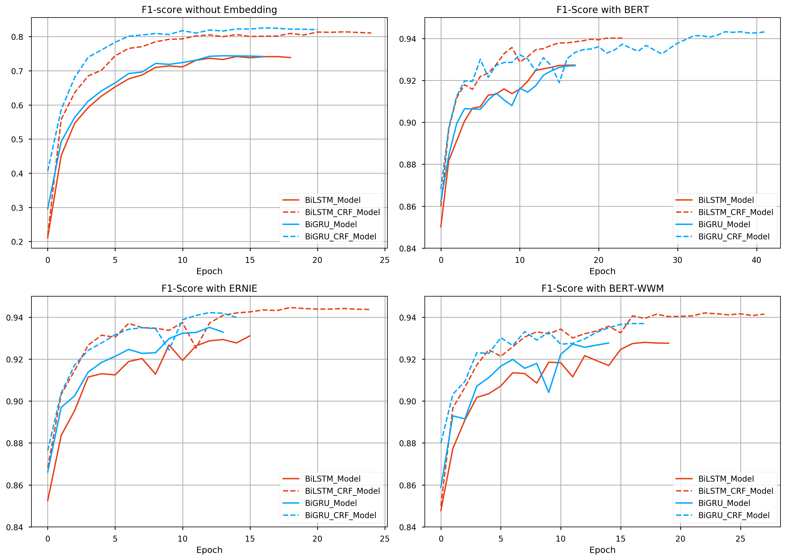

# Text Labeling Model

Kashgari provides several models for text labeling,
All labeling models inherit from the `BaseLabelingModel`.
You could easily switch from one model to another just by changing one line of code.

## Available Models

| Name               | Info |
| ------------------ | ---- |
| CNN\_LSTM\_Model   |      |
| BiLSTM\_Model      |      |
| BiLSTM\_CRF\_Model |      |
| BiGRU\_Model       |      |
| BiGRU\_CRF\_Model  |      |

## Train basic NER model

Kashgari provices basic NER corpus for expirement. You could also use your corpus in any language for training.

```python
# Load build-in corpus.
## For Chinese
from kashgari.corpus import ChineseDailyNerCorpus

train_x, train_y = ChineseDailyNerCorpus.load_data('train')
valid_x, valid_y = ChineseDailyNerCorpus.load_data('valid')
test_x, test_y = ChineseDailyNerCorpus.load_data('test')

## For English
from kashgari.corpus import CONLL2003ENCorpus

train_x, train_y = CONLL2003ENCorpus.load_data('train')
valid_x, valid_y = CONLL2003ENCorpus.load_data('valid')
test_x, test_y = CONLL2003ENCorpus.load_data('test')

# Or use your own corpus
train_x = [['Hello', 'world'], ['Hello', 'Kashgari'], ['I', 'love', 'Beijing']]
train_y = [['O', 'O'], ['O', 'B-PER'], ['O', 'B-LOC']]

valid_x, valid_y = train_x, train_y
test_x, test_x = train_x, train_y
```

Or use your own corpus, it needs to be tokenized like this.

```python
>>> print(train_x[0])
['海', '钓', '比', '赛', '地', '点', '在', '厦', '门', '与', '金', '门', '之', '间', '的', '海', '域', '。']

>>> print(train_y[0])
['O', 'O', 'O', 'O', 'O', 'O', 'O', 'B-LOC', 'I-LOC', 'O', 'B-LOC', 'I-LOC', 'O', 'O', 'O', 'O', 'O', 'O']
```

Then train our first model. All models provided some APIs, so you could use any labeling model here.

```python
import kashgari
from kashgari.tasks.labeling import BLSTMModel

model = BLSTMModel()
model.fit(train_x, train_y, valid_x, valid_y)

# Evaluate the model

model.evaluate(test_x, test_y)

# Model data will save to `saved_ner_model` folder
model.save('saved_ner_model')

# Load saved model
loaded_model = kashgari.utils.load_model('saved_ner_model')
loaded_model.predict(test_x[:10])

# To continue training, compile the newly loaded model first
loaded_model.compile_model()
model.fit(train_x, train_y, valid_x, valid_y)
```

That's all your need to do. Easy right.

## Sequence labeling with transfer learning

Kashgari provides varies Language model Embeddings for transfer learning. Here is the example for BERT Embedding.

```python
import kashgari
from kashgari.tasks.labeling import BLSTMModel
from kashgari.embeddings import BERTEmbedding

bert_embed = BERTEmbedding('<PRE_TRAINED_BERT_MODEL_FOLDER>',
                           task=kashgari.LABELING,
                           sequence_length=100)
model = BLSTMModel(bert_embed)
model.fit(train_x, train_y, valid_x, valid_y)
```

You could replace bert_embedding with any Embedding class in `kashgari.embeddings`. More info about Embedding: LINK THIS.

## Adjust model's hyper-parameters

You could easily change model's hyper-parameters. For example, we change the lstm unit in `BLSTMModel` from 128 to 32.

```python
from kashgari.tasks.labeling import BLSTMModel

hyper = BLSTMModel.get_default_hyper_parameters()
print(hyper)
# {'layer_blstm': {'units': 128, 'return_sequences': True}, 'layer_dropout': {'rate': 0.4}, 'layer_time_distributed': {}, 'layer_activation': {'activation': 'softmax'}}

hyper['layer_blstm']['units'] = 32

model = BLSTMModel(hyper_parameters=hyper)
```

## Use custom optimizer

Kashgari already supports using customized optimizer, like RAdam.

```python
from kashgari.corpus import SMP2018ECDTCorpus
from kashgari.tasks.classification import BiLSTM_Model
# Remember to import kashgari before than RAdam
from keras_radam import RAdam

train_x, train_y = SMP2018ECDTCorpus.load_data('train')
valid_x, valid_y = SMP2018ECDTCorpus.load_data('valid')
test_x, test_y = SMP2018ECDTCorpus.load_data('test')

model = BiLSTM_Model()
# This step will build token dict, label dict and model structure
model.build_model(train_x, train_y, valid_x, valid_y)
# Compile model with custom optimizer, you can also customize loss and metrics.
optimizer = RAdam()
model.compile_model(optimizer=optimizer)

# Train model 
model.fit(train_x, train_y, valid_x, valid_y)
```

## Use callbacks

Kashgari is based on keras so that you could use all of the [tf.keras callbacks](https://www.tensorflow.org/api_docs/python/tf/keras/callbacks) directly with
Kashgari model. For example, here is how to visualize training with tensorboard.

```python
from tensorflow.python import keras
from kashgari.tasks.labeling import BLSTMModel
from kashgari.callbacks import EvalCallBack


model = BLSTMModel()

tf_board_callback = keras.callbacks.TensorBoard(log_dir='./logs', update_freq=1000)

# Build-in callback for print precision, recall and f1 at every epoch step
eval_callback = EvalCallBack(kash_model=model,
                             valid_x=valid_x,
                             valid_y=valid_y,
                             step=5)

model.fit(train_x,
          train_y,
          valid_x,
          valid_y,
          batch_size=100,
          callbacks=[eval_callback, tf_board_callback])
```

## Customize your own model

It is very easy and straightforward to build your own customized model,
just inherit the `BaseLabelingModel` and implement the `get_default_hyper_parameters()` function
and `build_model_arc()` function.

```python
from typing import Dict, Any

from tensorflow import keras

from kashgari.tasks.labeling.base_model import BaseLabelingModel
from kashgari.layers import L

import logging
logging.basicConfig(level='DEBUG')

class DoubleBLSTMModel(BaseLabelingModel):
    """Bidirectional LSTM Sequence Labeling Model"""

    @classmethod
    def get_default_hyper_parameters(cls) -> Dict[str, Dict[str, Any]]:
        """
        Get hyper parameters of model
        Returns:
            hyper parameters dict
        """
        return {
            'layer_blstm1': {
                'units': 128,
                'return_sequences': True
            },
            'layer_blstm2': {
                'units': 128,
                'return_sequences': True
            },
            'layer_dropout': {
                'rate': 0.4
            },
            'layer_time_distributed': {},
            'layer_activation': {
                'activation': 'softmax'
            }
        }

    def build_model_arc(self):
        """
        build model architectural
        """
        output_dim = len(self.processor.label2idx)
        config = self.hyper_parameters
        embed_model = self.embedding.embed_model

        # Define your layers
        layer_blstm1 = L.Bidirectional(L.LSTM(**config['layer_blstm1']),
                                       name='layer_blstm1')
        layer_blstm2 = L.Bidirectional(L.LSTM(**config['layer_blstm2']),
                                       name='layer_blstm2')

        layer_dropout = L.Dropout(**config['layer_dropout'],
                                  name='layer_dropout')

        layer_time_distributed = L.TimeDistributed(L.Dense(output_dim,
                                                           **config['layer_time_distributed']),
                                                   name='layer_time_distributed')
        layer_activation = L.Activation(**config['layer_activation'])

        # Define tensor flow
        tensor = layer_blstm1(embed_model.output)
        tensor = layer_blstm2(tensor)
        tensor = layer_dropout(tensor)
        tensor = layer_time_distributed(tensor)
        output_tensor = layer_activation(tensor)

        # Init model
        self.tf_model = keras.Model(embed_model.inputs, output_tensor)

model = DoubleBLSTMModel()
model.fit(train_x, train_y, valid_x, valid_y)
```

## Speed up using CuDNN cell

You can speed up training and inferencing process using [CuDNN cell](https://stackoverflow.com/questions/46767001/what-is-cudnn-implementation-of-rnn-cells-in-tensorflow). CuDNNLSTM and CuDNNGRU layers are much faster than LSTM and GRU layer, but they must be used on GPU. If you want to train on GPU and inferencing on CPU, you cannot use CuDNN cells.

```python
# Enable use cudnn cell
kashgari.config.use_cudnn_cell = True
```

## Performance report

Available model list, matrics based on this training:

- corpus: ChineseDailyNerCorpus
- epochs: 50 epochs with callbacks
- batch_size: 64
- T4 GPU / 2 CPU / 30 GB on [openbayes](https://openbayes.com)
- [colab link](https://drive.google.com/file/d/1-tPlD3jP_5AK8xOz_CE1-p-s9mttUt16/view?usp=sharing)

```python
early_stop = keras.callbacks.EarlyStopping(patience=10)
reduse_lr_callback = keras.callbacks.ReduceLROnPlateau(factor=0.1, patience=5)
```

| Name             | Embedding   | F1 Score | Epoch Time | Non Trainable params | Trainable params |
| ---------------- | ----------- | :------: | ---------- | :------------------- | :--------------- |
| BiLSTM_Model     | Random Init | 0.74147  | 9.5s       | 0                    | 558176           |
| BiLSTM_CRF_Model | Random Init | 0.81378  | 123.0s     | 0                    | 573168           |
| BiGRU_Model      | Random Init | 0.74375  | 9.7s       | 0                    | 499296           |
| BiGRU_CRF_Model  | Random Init | 0.82516  | 120.7s     | 0                    | 514288           |
|                  |             |          |            |                      |                  |
| BiLSTM_Model     | BERT        | 0.92727  | 183.0s     | 101360640            | 3280904          |
| BiLSTM_CRF_Model | BERT        | 0.94013  | 265.0s     | 101360640            | 3295896          |
| BiGRU_Model      | BERT        | 0.92700  | 180.4s     | 101360640            | 2461192          |
| BiGRU_CRF_Model  | BERT        | 0.94319  | 263.4s     | 101360640            | 2476184          |
|                  |             |          |            |                      |                  |
| BiLSTM_Model     | ERNIE       | 0.93109  | 167.6s     | 98958336             | 3280904          |
| BiLSTM_CRF_Model | ERNIE       | 0.94460  | 250.6s     | 98958336             | 3295896          |
| BiGRU_Model      | ERNIE       | 0.93512  | 165.7s     | 98958336             | 2461192          |
| BiGRU_CRF_Model  | ERNIE       | 0.94218  | 250.4s     | 98958336             | 2476184          |


